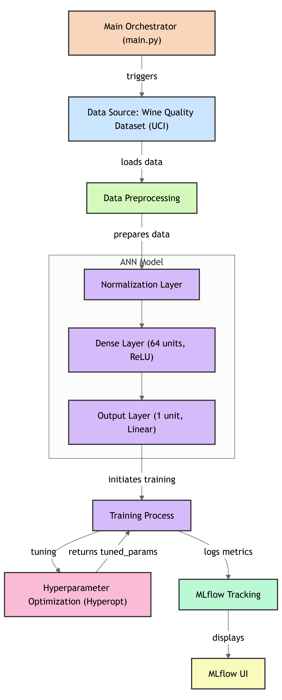

# 🍷 Wine Quality Predictor with ANN + Hyperopt + MLflow

A deep learning project to predict the quality of white wine using an Artificial Neural Network. It includes hyperparameter optimization using Hyperopt and experiment tracking using MLflow.





---

## 📊 Dataset

- **Source**: White Wine Quality Data Set from UCI Machine Learning Repository  
- **URL**: [Wine Quality Dataset](https://raw.githubusercontent.com/mlflow/mlflow/master/tests/datasets/winequality-white.csv)  
- **Target variable**: `quality` (a score between 0–10)

---

## 🧠 Model Architecture

- **Framework**: TensorFlow / Keras
- **Layers**:
  - Normalization layer (with training mean and variance)
  - Dense (64 units, ReLU)
  - Output (1 unit, linear)
- **Loss**: Mean Squared Error
- **Metric**: Root Mean Squared Error (RMSE)

---

## 🔁 Hyperparameter Optimization

- **Tool**: [Hyperopt](https://github.com/hyperopt/hyperopt)
- **Search space**:
  - `learning_rate`: log-uniform between 1e-4 and 1e-1
  - `momentum`: uniform between 0.1 and 0.9
- **Optimization algorithm**: Tree of Parzen Estimators (TPE)

---

## 📦 MLflow Integration

- Logs all:
  - Hyperparameters
  - Metrics (RMSE)
  - Trained models (TensorFlow/Keras)
- Launch MLflow UI:

```bash
mlflow ui

git clone <your-repo-url>
cd <your-repo-folder>

python -m venv venv
venv\Scripts\activate

pip install -r requirements.txt

python main.py

